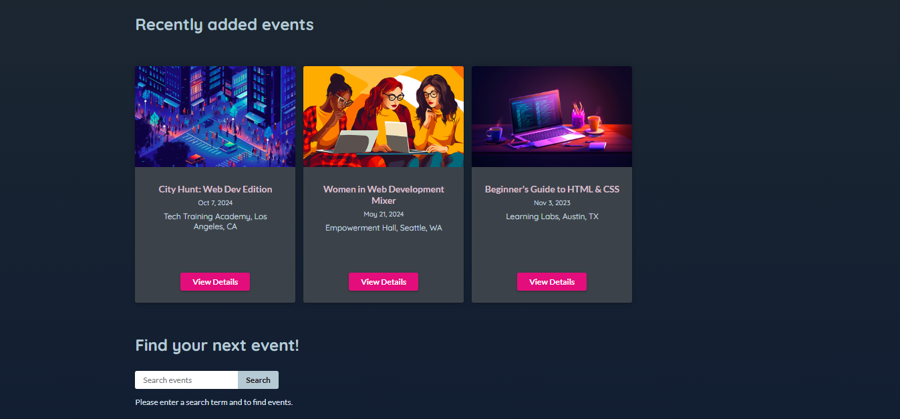
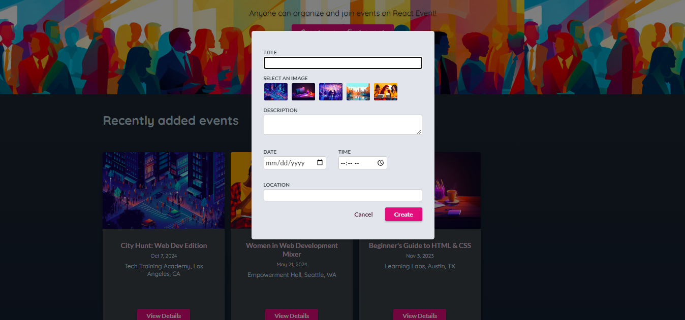
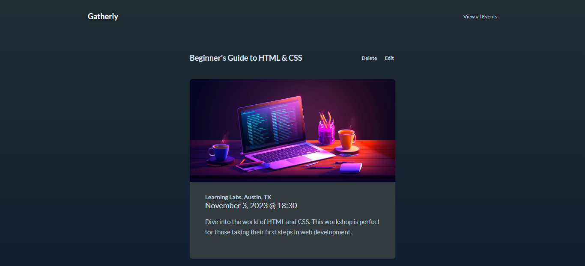
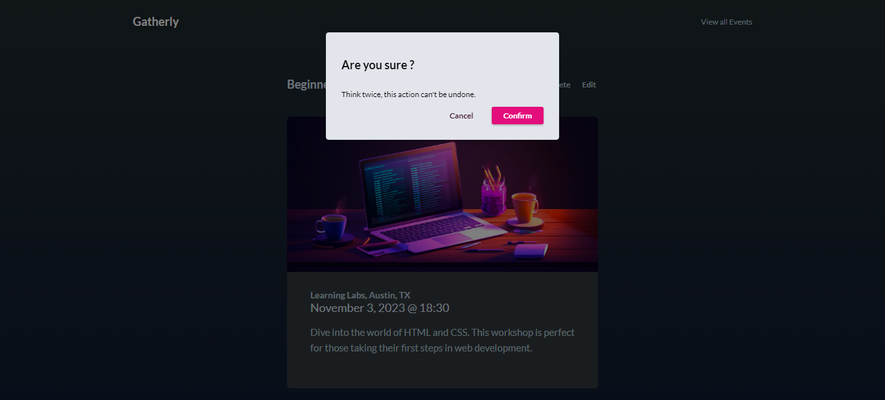

# Gatherly

[](https://react.dev/)


**Gatherly** is a feature-rich application for managing events using the power of React Router and React Query. The project showcases advanced routing capabilities, efficient server communication, and smooth user experience through state management and asynchronous operations.

## Features

### **Data Management with React Query**

- Fetching and caching event data for optimized performance.
- Real-time data mutations, including creating, updating, and deleting events.
- Automatic query invalidation to keep data fresh after mutations.

### **Routing with React Router**

- Dynamic routing for various pages, including event details, creation, and editing.
- Nested routes for streamlined navigation within the app.

### **Event Functionality**

- **Create New Event**: Add new events with relevant details.
- **Search Events**: Find events using keywords.
- **Edit Existing Events**: Modify event details seamlessly.
- **Delete Events**: Remove outdated or unwanted events from the list.

## Usage Guide

### Event Management :

- Navigate to `/events` to view all events.
- Use the "Create New Event" button to add an event.
- Click on an event to view its details or edit it.
- Use the search bar to find events matching your keywords.

### Routing :

- Home `(/)` : Redirects to /events.
- Events `(/events)` : Displays all available events.
- New Event `(/events/new)` : Allows adding a new event.
- Event Details `(/events/:id)` : View details of a specific event.
- Edit Event `(/events/:id/edit)` : Edit details of an existing event.

## Development Highlights

### React Query Integration :

- Utilizes useQuery and useMutation hooks for fetching and updating data.
- Automatically caches data and refreshes stale queries when needed.

### React Router Features :

- Implements nested routing for child components.
- Supports URL parameters for dynamic routing.

## Project Overview :

### Overview


### All Events Overview



### New Event Overview



### Event Detail Overview



### Edit Event Overview

.png>)

### Delete Event Overview



## Project Structure

```
Gatherly
│      .eslintrc.cjs
│      .gitignore
│      index.html
│      package-lock.json
│      package.json
│      README.md
│      vite.config.js
│
└─── public -----> All images's sources
│
└─── src
│   │    App.jsx
│   │    index.css
│   │    main.jsx
│   │
│   └─── components
│   │  │  Header.jsx
│   │  │  ImagePicker.jsx
│   │  │
│   │  └─── Events
│   │  │      EditEvent.jsx
│   │  │      EventDetails.jsx
│   │  │      EventForm.jsx
│   │  │      EventItem.jsx
│   │  │      Events.jsx
│   │  │      EventsIntroSection.jsx
│   │  │      FindEventSection.jsx
│   │  │      NewEvent.jsx
│   │  │      NewEventsSection.jsx
│   │  │
│   │  └─── UI
│   │         ErrorBlock.jsx
│   │         LoadingIndicator.jsx
│   │         Modal.jsx
│   │
│   │
│   └─── util
│   │     http.js
│   │
│   └─── assets
│        events-logo.png
│        meetuo.png
│
└─── backend
│     │
│     │  app.js
│     │  package-lock.json
│     │  package.json
│     │
│     └───public -------> All Images's Sources
│     │
│     └─── data
│           events.json
│           images.json
│
│
```

## Installation

To get started with the project locally:

1. Clone the repository:
   ```bash
   git clone https://github.com/SalahShallapy/Gatherly.git
   ```
2. Navigate to the project directory:
   ```bash
   cd Gatherly
   ```
3. Navigate to the backend directory:
   ```bash
   cd backend
   ```
4. Install backend dependencies:
   ```bash
   npm install
   ```
5. Run the backend server:
   ```bash
   npm start
   ```
6. Navigate out of the backend directory to the main project directory:
   ```bash
   cd ..
   ```
7. Install dependencies:
   ```bash
   npm install
   ```
8. Run the project:
   ```bash
   npm run dev
   ```

## Note

- This project's backend is locally setup and is not running on a server so you have to follow the installing steps and start the backend server in order to see the fetched data on the frontend UI

## Contributing

Contributions are what make the open source community such an amazing place to learn, inspire, and create. Any contributions you make are **greatly appreciated**.

If you have a suggestion that would make this better, please fork the repo and create a pull request. You can also simply open an issue with the tag "enhancement".
Don't forget to give the project a star! Thanks!

1.  Fork the Project
2.  Create your Feature Branch (`git checkout -b feature/AmazingFeature`)
3.  Commit your Changes (`git commit -m 'Add some AmazingFeature'`)
4.  Push to the Branch (`git push origin feature/AmazingFeature`)
5.  Open a Pull Request

   <p align="right">(<a href="#top">back to top</a>)</p>
